# Danjjak Database Contract

## Purpose

This document explains the current database contract for the Danjjak hackathon MVP. It records the decisions that affect implementation so contributors and coding agents can preserve the intended model instead of inferring a larger banking platform.

The executable source of truth is [`db/migration/V1__initial_schema.sql`](../../../../db/migration/V1__initial_schema.sql). If this document and an applied migration disagree, inspect the migration history and resolve the documentation mismatch before changing application behavior.

## Product Boundary

Danjjak demonstrates how an older user can start a familiar financial task from a numbered shortcut, follow step-by-step guidance, complete a mock task, and receive an additional warning for an anomalous transfer.

The persistence model supports:

- Kakao OAuth user identification
- Accessibility preferences
- Current usage-log and guardian-sharing consent choices
- One guardian contact
- Registered people and mock accounts
- Numbered financial-task patterns and their steps
- TTS text and family-recorded voice paths
- Pattern runs and step-visit behavior
- Mock balances and transaction history
- Deterministic transfer anomaly rules

The following concerns are outside this database contract:

- Real bank or payment-network integration
- Settlement, reconciliation, and ledger accounting
- Production authentication, authorization, and audit systems
- Idempotency and concurrent balance-update infrastructure
- Machine-learning FDS models
- Long-term notification delivery history
- Consent history and policy versioning

Do not add data structures for these concerns unless the product scope explicitly changes.

## Model Overview

The schema contains ten application tables.

| Area | Tables | Responsibility |
|---|---|---|
| User | `users`, `guardian_contacts` | OAuth identity, current consent and accessibility preferences, and one guardian contact |
| Mock finance | `registered_persons`, `bank_accounts`, `transactions` | Recipients, owned and recipient accounts, balances, and transaction history |
| Guidance | `financial_patterns`, `pattern_steps` | Shortcut configuration, task type, ordered guidance, UI target, and recorded voice path |
| Execution and safety | `pattern_executions`, `step_execution_logs`, `anomaly_events` | Task runs, step behavior, deterministic anomaly detection, and the user's final decision |

```mermaid
erDiagram
    users ||--o| guardian_contacts : has
    users ||--o{ registered_persons : registers
    users ||--o{ bank_accounts : manages
    registered_persons ||--o{ bank_accounts : owns

    users ||--o{ financial_patterns : configures
    bank_accounts o|--o{ financial_patterns : is_linked_to
    financial_patterns ||--|{ pattern_steps : consists_of

    financial_patterns ||--o{ pattern_executions : runs
    bank_accounts o|--o{ pattern_executions : is_source_for
    pattern_executions ||--o{ step_execution_logs : records
    pattern_steps ||--o{ step_execution_logs : is_measured_by

    users ||--o{ transactions : has
    bank_accounts ||--o{ transactions : records
    pattern_executions o|--o| transactions : produces

    users ||--o{ anomaly_events : has
    pattern_executions o|--o| anomaly_events : triggers
    transactions o|--o| anomaly_events : resolves_to
    bank_accounts ||--o{ anomaly_events : is_source_for
```

Use these concepts consistently:

- A **pattern** defines a reusable task and its shortcut.
- An **execution** records one attempt to perform that task.
- A **transaction** records the mock financial result of a completed operation.
- An **anomaly event** records a warning decision that occurs before a transaction may exist.

## Table Decisions

### `users`

`users` stores the Kakao identity, current consent choices, and accessibility preferences for the senior user.

- `kakao_user_id` is unique but nullable before the first OAuth login.
- A seeded demo user owns the mock accounts, patterns, and transactions before OAuth binding.
- On the first successful OAuth callback, bind the returned Kakao user ID to that seeded user.
- Later logins resolve the same user by `kakao_user_id`.
- Usage-log and guardian-sharing consent values store only the current choices.
- `consent_completed` distinguishes two rejected choices from a user who has not completed the consent step.
- Font size, voice speed, and guide voice type stay on this table because each user has one current setting and no settings history is required.

The login flow uses Kakao OAuth only. Do not add a login password or login PIN unless the authentication requirement changes explicitly.

### `guardian_contacts`

`guardian_contacts` stores one phone number per user.

- The guardian is not a service user and has no separate login.
- `user_id` is unique because the MVP supports one guardian.
- No guardian-device pairing, invitation, permission, or approval data is required.
- An anomaly event stores its notification timestamp; a separate notification-history table is not required.

### `registered_persons`

`registered_persons` stores recognizable transfer recipients such as a son or daughter.

- Person data is separate from account data to avoid repeating the name and relationship for every account.
- Demo seed data uses one account per registered person.
- The relationship remains one-to-many so explicitly adding another account does not require duplicating the person.
- A registered person is not assumed to be a Danjjak user.

### `bank_accounts`

`bank_accounts` represents both the senior user's accounts and registered recipients' accounts. Keeping them together gives patterns and transactions one account reference model.

Account ownership is determined by `registered_person_id`:

| Condition | Meaning | `balance` | `account_pin_hash` |
|---|---|---|---|
| `registered_person_id IS NULL` | Senior user's own account | Required | Required |
| `registered_person_id IS NOT NULL` | Registered recipient account | Must be null | Must be null |

Important rules:

- `user_id` identifies the Danjjak user managing the account record, not necessarily the real-world account holder.
- The initial demo has two owned accounts and one account for each registered recipient.
- The account PIN is a mock final-confirmation credential for transfers, not a login credential.
- Store only a one-way PIN hash. Never store or log the raw PIN.
- Direct transfer to a new account does not automatically create a `bank_accounts` row.

### `financial_patterns`

`financial_patterns` combines a numbered shortcut with its reusable financial-task definition.

A separate shortcut table is unnecessary because one active pattern occupies one shortcut number in the current product.

- Active patterns require a shortcut number from 1 through 12.
- Deactivating a pattern sets `is_active` to false and releases the number by setting `shortcut_number` to null.
- `linked_bank_account_id` is used when a task has a predefined account, such as a transfer to a registered family member.
- A task without a fixed account leaves that reference null and receives runtime input.
- `pattern_type` uses `VARCHAR` plus a database `CHECK`, which keeps MyBatis mapping simple while retaining controlled values.

The initial eight shortcuts are:

1. Transfer to son
2. Check pension deposit
3. Check management fee
4. Check balance
5. View transaction history
6. Contact customer center
7. Transfer to daughter
8. Check utility bill

Additional allowed pattern types are not required in the initial seed.

### `pattern_steps`

`pattern_steps` stores the ordered guidance for a pattern.

Each step can provide:

- A stable step code and order
- A display name
- The current instruction text used for captions or TTS
- A screen code
- An optional UI element ID to highlight
- An optional family voice file path and content type

Audio binary data does not belong in MySQL. Store the recording in the selected file-storage mechanism and persist only its path and content type. The exact storage directory or provider is an implementation decision, not a new relational entity.

Only the current instruction and current family recording are required. Do not introduce guide-version or recording-history tables unless history becomes an explicit user-visible feature.

### `pattern_executions`

`pattern_executions` stores one task attempt from start to terminal state.

- Valid states are `STARTED`, `COMPLETED`, `CANCELLED`, and `FAILED`.
- `source_bank_account_id` is optional because lookup and customer-center patterns do not require an account.
- The user is derived through the pattern and is not duplicated.
- Total duration is derived from `started_at` and `ended_at`.
- Financial-task usage counts are derived by grouping these rows by pattern and status.

Do not add cached execution counts unless a demonstrated query-performance requirement appears.

### `step_execution_logs`

`step_execution_logs` stores one row per visit to a pattern step.

A visit starts when the user enters a step and ends when the user leaves it. Returning to the same step creates a new row with a higher `visit_number`.

Each visit aggregates:

- Retry count
- Back-navigation count
- Wrong-touch count
- Route-deviation flag
- Completion flag
- Start and end timestamps

Duration is derived from the timestamps. Do not add a raw click-event table for the current demo.

The current summary UI shows financial-task execution counts. It does not show solo-completion or help-request metrics, so do not add help columns without a new requirement and a precise event definition.

### `transactions`

`transactions` stores both seeded mock history and transfers completed through Danjjak.

- `pattern_execution_id` is nullable because seeded historical rows did not originate from a Danjjak execution.
- When present, it is unique because one execution produces at most one transaction.
- `user_id` is intentionally stored to keep the primary history query direct.
- `balance_after` preserves the displayed balance at the transaction time.
- Counterparty name, bank, and account number are snapshots that preserve history if registered data changes later.
- A direct transfer can store counterparty snapshots without creating a registered account.
- KRW amounts use `DECIMAL(15, 0)` because the demo does not use fractional currency.

Create the transaction and update the owned account balance in one Spring transaction.

### `anomaly_events`

`anomaly_events` stores one anomalous transfer attempt and its resolution. Normal transfers do not create a row.

The current rules are deterministic:

- `high_amount_detected`: amount is at least KRW 10,000,000.
- `repeated_transfer_detected`: at least two completed outgoing transfers occurred during the previous ten minutes, so the current attempt is the third.
- One triggered rule produces `MEDIUM` risk.
- Both triggered rules produce `HIGH` risk.

Do not infer new-recipient, route-deviation, weighted-score, or machine-learning rules.

Resolution rules:

- `CONTINUE` requires a resulting `transactions` row.
- `CANCEL` requires no transaction.
- `rechecked` records whether the user reviewed the information again.
- A successful guardian notification for the high-risk demo stores `guardian_notified_at`.
- Recipient and amount snapshots remain available even when the transfer is cancelled.

`pattern_execution_id` may be null for a direct transfer that did not start from a registered shortcut. `transaction_id` remains null until the user continues and the mock transaction is created.

## Primary Data Flows

### First OAuth Login

1. Kakao OAuth returns an external user ID.
2. Look for an existing user with that `kakao_user_id`.
3. If none exists, bind the ID to the unbound seeded demo user.
4. Return the user, current consent choices, and accessibility preferences from `users`.

The demo has one seeded user. Do not build a general account-claiming or pairing system around this flow.

### Pattern Execution

1. Load active `financial_patterns` ordered by shortcut number.
2. Load the selected pattern's `pattern_steps` ordered by `step_order`.
3. Create a `pattern_executions` row with `STARTED`.
4. Create one `step_execution_logs` row for each step visit.
5. Finish the execution with a terminal status and `ended_at`.

### Normal Mock Transfer

1. Start the transfer pattern execution.
2. Record step visits.
3. Verify the raw PIN against the selected owned account's stored hash.
4. Evaluate the anomaly rules immediately before confirmation.
5. If no rule triggers, update the owned account balance and create a transaction in one Spring transaction.
6. Complete the pattern execution.

### Anomalous Transfer

1. Evaluate the high-amount and repeated-transfer rules.
2. Create one `anomaly_events` row with the triggered flags, evidence count, risk, and transfer snapshots.
3. Record the user's review and final action.
4. If the user cancels, create no transaction and cancel the execution.
5. If the user continues and the account PIN is valid, update the balance, create the transaction, connect it to the anomaly event, and complete the execution.
6. Record `guardian_notified_at` only after the high-risk demo notification succeeds.

### Usage Summary and Guidance Update

1. Count task executions from `pattern_executions`.
2. Aggregate step duration, retries, back navigation, wrong touches, and deviation from `step_execution_logs` when a detailed analysis view needs them.
3. Compute deterministic guidance suggestions at request time.
4. Applying a suggestion updates the current `pattern_steps.instruction_text`.

Do not persist aggregate reports, generated comments, or suggestion history for the current product.

## Intentional Denormalization

The model keeps a small amount of deliberate duplication where it makes the demo reliable and the MyBatis queries clear.

| Data | Reason |
|---|---|
| `transactions.user_id` | Supports a direct user-history query. |
| Transaction counterparty snapshots | Preserve the historical display after registered data changes. |
| Anomaly recipient and amount snapshots | Preserve the warning context even when the transfer is cancelled. |
| `transactions.balance_after` | Preserves the displayed post-transaction balance. |

Do not remove these snapshots merely to increase normalization.

## Data That Stays Outside MySQL

Do not persist the following under the current requirements:

- Raw account PIN values
- OAuth access or refresh tokens in application tables
- Audio binary data
- Speech-to-text transcripts, embeddings, or RAG data
- Raw UI click events
- Login passwords or login PINs
- Guardian accounts and pairing records
- Consent history
- Notification message history
- AI analysis reports
- Generated guidance suggestions
- Guide-text or recording version history
- Automatically discovered recipient accounts
- UI animation, icon, and button-style configuration

Application configuration, frontend constants, request-time calculations, or the selected file store should handle these concerns.

## Relationship and Deletion Intent

- Use `RESTRICT` when deleting a referenced core record would make an execution or transaction inconsistent.
- Use `CASCADE` for records wholly owned by their parent, such as pattern steps or execution logs.
- Use `SET NULL` when snapshots allow history to remain meaningful after the referenced record disappears.
- Prefer pattern deactivation over physical deletion after execution history exists.

Application services must also verify ownership across relationships. For example, a pattern may link only to an account managed by the same user, even when a simple FK cannot express that cross-table invariant.

## Schema Change Test

Before proposing a table or column, answer all of these questions:

1. Does the requested behavior need the value after the current request or process ends?
2. Does the backend need the value to make a later decision?
3. Must the UI retrieve the exact historical value rather than derive or recompute it?
4. Can an existing table, snapshot, query, application constant, or file path represent it clearly?

Prefer no schema change when the value is derived, temporary, fixed for the demo, or purely visual. A schema change is justified when persisted state or exact history is part of the requested behavior and the current model cannot represent it.

## Migration and Seed Rules

- Follow `db/README.md` for migration naming and immutability rules.
- Do not edit a migration after it has been shared and applied.
- Keep schema changes and demo seed data in separate migrations.
- Store no real credentials, OAuth identifiers, account details, or raw PINs in Git.
- Seed owned accounts with a valid one-way demo PIN hash.
- Seed recipient accounts with null balance and null PIN hash.
- Keep anomaly seed history consistent with the configured deterministic rules.
- Validate the full migration chain on a clean MySQL 8.4 volume before committing.
